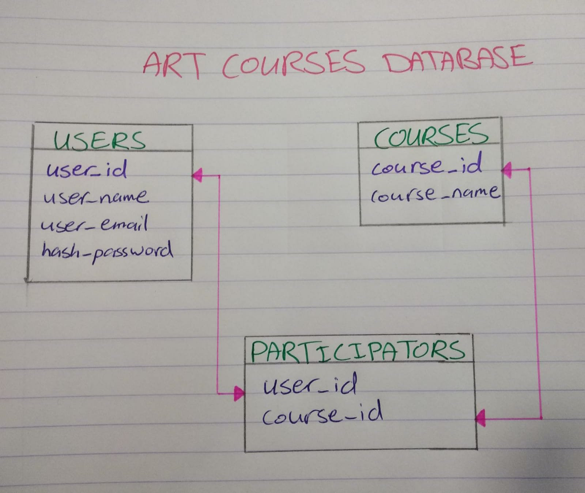
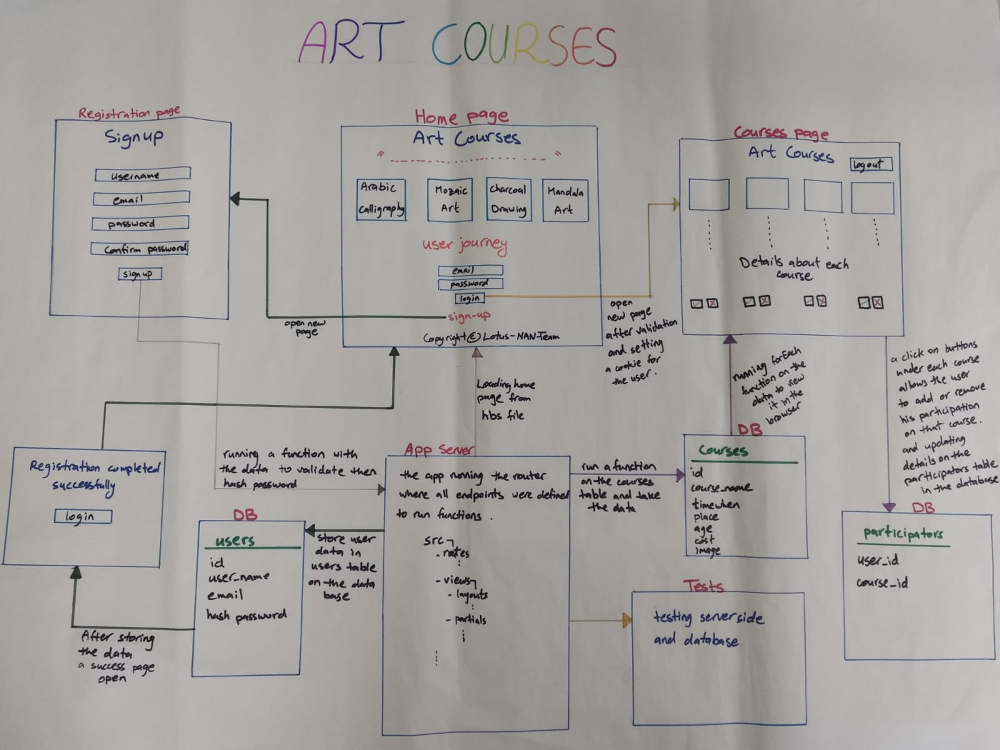

## ArtCourses-NAN ##

Team mates :  :sunglasses:
  * @AhlamKadour  :v:
  * @NaremanFero  :v:
  * @Noorb7188    :v:

We are planning to build an app about Art courses and in it we are enabling the user to choose a course to participate in.  

Steps :
 - we will deploy our app to Heroku.
 - we will build our database using `postgres.sql`.
 - the user must sign up to be able to log in, which then we will add him to our users table in the database, that this table has { user_id, user_name, user_email, user_password } columns.
 
 - we will use `bcrypt` to save a hashed password in the database.
 - we will use cookies to track the user's behavior in the website.
 - then the user will log in to see the details about each course {name, brief explanation about the course, time (date and hours), price, number of participators that already sign for this course (in it we will show number of participators for that course yet so the user can see if he can take part of that same course: like this [number of participators : 4 from 10])} and decide in which course he would like to participate , by clicking the `participate` button, which then he will be added to `participators` table that includes { par_id, par_name, par_email, course_name } columns.
 - there will be also a cancel button to cancel the participation.
 - a user that has signed for specific course will not be able to take part in another course, and we are planing to do that by checking if that user was added to `participators` table, if so the user will get a proper message that he can not take part of another course.
 - we will build our app using `express`.
 - we will write tests using `tape` and `supertest`.
 - we will use handlebars template in server side to render our pages threw the server.

Now for the Real Work : :muscle:   
our A.I in building the App :
- we divided the work between us by the issues we wrote after having a clear idea of our app.
- we had a clear architecture for our website. and here it is : :tada: :tada:

strech goals : :checkered_flag:
- to make the button turn to green :heavy_check_mark: after Registration.
- "welcome" `hbs` file instead of just a plain text.
- a middle ware function to check and validate all of our endpoints.

 *Hope you'll enjoy*
